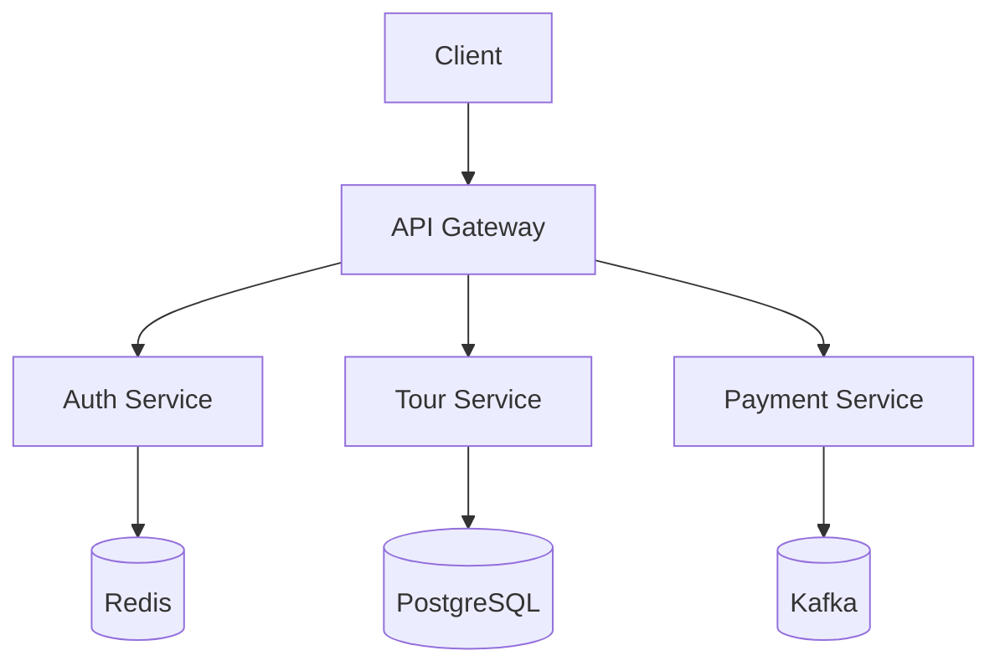

# 技術債務與改進報告

根據提供的專案內容，我以CTO角度進行技術審查，以下是系統性分析與建議：

## 一、邏輯缺失

### 1. **資料驗證不足**
- `trvic-spots-mock-data.ts` 中的景點資料缺少必要欄位驗證（如價格不可為負數、季節需符合預定義值）
- 登入頁面(`LoginPage.tsx`)未實作表單驗證邏輯，僅有UI顯示錯誤狀態

### 2. **狀態管理缺陷**
- 使用Zustand但未見明確的狀態持久化策略，離線支援可能失效
- `SessionManager.tsx` 中的團次狀態轉換（如 soliciting → guaranteed）缺少業務規則驗證

### 3. **權限控制漏洞**
- 角色映射函數(`mapUserRoleToAppRole`)未處理未知角色類型的fallback機制
- 缺少API層級的權限驗驗證，僅依賴前端路由控制

### 4. **資料一致性問題**
- 行程版本控制(`itinerary_versions`)未見衝突解決機制
- 飯店房型分配與座位分配缺少庫存鎖定邏輯

## 二、技術漏洞

### 1. **安全風險**
- 登入頁面Demo帳號明文寫在程式碼中（`DEMO_ACCOUNTS`）
- API金鑰錯誤(401)顯示在`Report.md`，但未見金鑰輪換機制
- 缺少CSRF保護和CORS明確設定

### 2. **效能瓶頸**
- 圖片使用Unsplash隨機API(`/random/`)可能導致重複請求
- PWA預緩存策略(`vite.config.ts`)未針對大檔案做分塊處理

### 3. **類型安全問題**
- `types.ts`中多處可選屬性(?)過度使用，降低類型約束力
- 缺少API回應類型的TypeScript定義

### 4. **測試覆蓋不足**
- Vitest配置未包含關鍵業務邏輯測試（如報價計算）
- 缺少E2E測試和效能測試套件

## 三、改進建議

### 1. **架構強化**

- 導入BFF模式分離前端與微服務
- 實作CQRS模式處理複雜查詢

### 2. **關鍵技術改進**
- **安全**：
  - 實作JWT輪換機制
  - 加入Sentry監控敏感操作
- **資料**：
  - 使用PostGIS處理景點地理資料
  - 導入Event Sourcing記錄團次狀態變更
- **效能**：
  - 圖片CDN加上簽章驗證
  - 實作SWR策略替代部分React Query

### 3. **代碼品質提升**
```typescript
// 建議改用更嚴格的類型約束
interface Spot {
  id: string;
  name: string;
  county: CountyType; // 改用enum而非string
  category: SpotCategory[]; 
  price: PositiveNumber;
  coordinates?: GeoJSON.Point;
}
```

### 4. **DevOps建議**
- 在Vercel配置中加入安全頭部(Security Headers)
- 建立多環境部署流程(dev/staging/prod)
- 實作API契約測試(OpenAPI)

### 5. **業務邏輯補強**
- 增加景點關聯推薦演算法
- 實作動態定價策略模組
- 加入保險計算與合規檢查

## 四、優先處理項目

建議優先處理高風險項目：
1. 修正Demo帳號安全問題
2. 補齊API類型定義
3. 實作完整的狀態機驗證
4. 加強錯誤監控機制

此系統架構整體設計現代化，但在企業級應用所需的嚴謹性與擴展性仍需加強，特別在安全與資料一致性方面需要重點改善。
