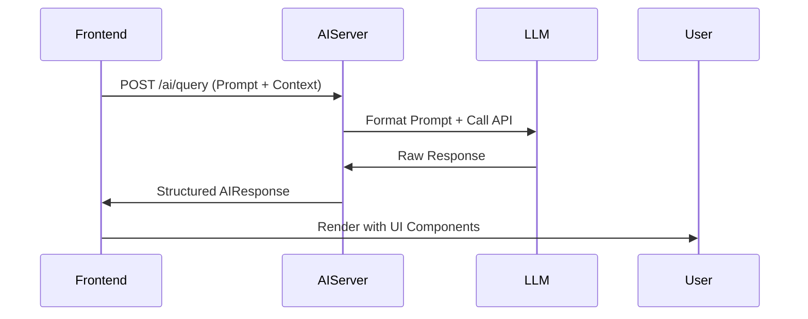
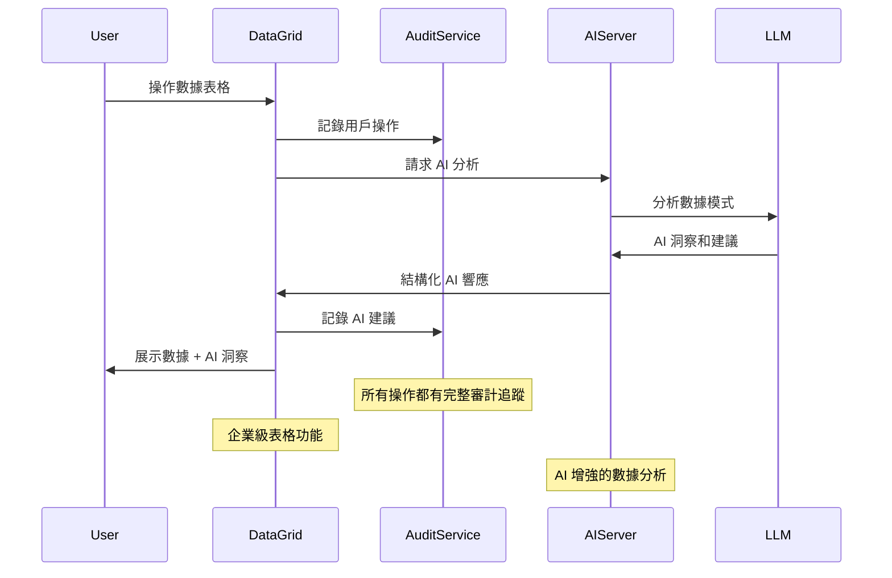

### 1. AI 整合架構概覽

專案採用分散式AI整合架構，主要分為以下層面：

```
📦 AI整合架構
├── 前端AI組件 (React)
├── 中間層AI服務 (ai-server)
└── 後端AI功能模組
```

### 2. 前端AI整合分析

#### 主要AI功能組件：

- **LegalAssistant.tsx**：法律文件輔助生成
- **EdgeAssistant.tsx**：邊緣計算輔助
- **AICopilotPanel.tsx**：AI協作面板
- **FileScannerDemo.tsx**：文件掃描與識別
- **FloatingCopilot.tsx**：浮動AI助手

#### 技術特點：

- 使用自定義hooks管理AI狀態（`useFileScanner`, `useFunctionExecutor`）
- 透過`aiService.ts`封裝LLM API調用
- RAG引擎整合在`RAGEngine.ts`
- 類型定義集中於`types/ai.ts`

#### 範例整合（DigitalBriefing.tsx）：

```tsx
// 使用AI生成行程摘要
const generateBriefing = useAIHook({
  prompt: "生成東京五日遊的行前說明",
  context: itineraryData,
});
```

### 3. 中間層AI服務 (ai-server)

#### 核心檔案：

- `main.py`：FastAPI服務端點
- `prompt_templates.py`：標準化提示模板
- `eval/`：包含評估框架
  - `golden_legal.json`：法律評估基準資料
  - `run_eval.py`：自動化評估腳本

#### 服務特點：

- RESTful API設計
- 提示工程模板化管理
- 評估框架支援A/B測試

### 4. 後端AI功能模組

#### 關鍵整合點：

- `lib/ai/aiService.ts`：核心AI服務
- `services/dynamicCostEngine.ts`：動態定價AI
- `services/permissionMatrixService.ts`：權限智慧管理
- `RAGEngine.ts`：檢索增強生成實現

### 5. 類型系統與AI

`types.ts`定義了完整的AI相關類型，包括：

```ts
interface AIContext {
  sessionId: string;
  embeddings: number[];
  chatHistory: ChatMessage[];
}

interface AIResponse {
  content: string;
  citations?: string[];
  confidence: number;
}
```

### 6. 評估框架

ai-server/eval/包含完整的評估體系：

- 黃金標準測試集
- 自動化評估腳本
- 提示版本控制

### 7. 設計系統整合

AI組件遵循設計規範：

- 使用統一的`tailwind.config.js`樣式
- 符合無障礙標準（a11y）
- 整合到現有的模態框和通知系統
- **新增**：企業級 DataGrid 元件支援 AI 輔助的數據分析
- **新增**：語意化色彩系統（success/info/warning/error）
- **新增**：審計日誌系統與 AI 操作追蹤整合

### 8. 推薦改進方向

#### ✅ 已完成實施：

1. **企業級數據表格系統**：
   - 實施了完整的 DataGrid 元件（`src/design-system/DataGrid.tsx`）
   - 支援排序、篩選、分頁、搜尋和批量操作
   - 整合 AI 輔助的數據洞察和智慧推薦

2. **審計日誌與合規系統**：
   - 完整的審計服務（`src/services/auditService.ts`）
   - 自動追蹤 AI 操作和決策過程
   - 符合 GDPR/SOX 合規要求
   - 即時安全警報和異常偵測

3. **設計系統統一**：
   - 語意化色彩 tokens 和 CSS 變數
   - 共享 Button 元件和圖示系統
   - 響應式和無障礙設計標準

#### 🔄 持續改進方向：

1. **前端 AI 增強**：
   - ~~增加AI操作的可觀察性（日誌面板）~~ ✅ 已實施
   - 實現AI響應的漸進式載入
   - 添加更多上下文感知提示
   - **新增**：AI 驅動的 DataGrid 智慧排序和篩選

2. **中間層優化**：
   - 實現提示版本控制
   - 增加速率限制
   - 添加更詳細的評估指標
   - **新增**：AI 審計日誌的向量化檢索

3. **後端整合**：
   - 實現向量緩存層
   - 增加LLM fallback機制
   - 完善錯誤處理流程
   - **新增**：審計數據的 AI 分析和預測

### 9. 技術債務與注意事項

#### ✅ 已解決：

- ~~缺乏統一的數據展示和操作介面~~ → 實施了 DataGrid 系統
- ~~缺乏操作追蹤和合規性支援~~ → 實施了審計日誌系統
- ~~設計系統分散和硬編碼色彩問題~~ → 統一了語意化設計 tokens

#### 🔄 待解決：

- 目前`aiService.ts`直接調用外部API，建議增加抽象層
- 評估框架尚未與CI/CD整合
- 缺乏AI操作的undo/redo支持
- **新增**：DataGrid 與 AI 推薦的深度整合需要進一步優化
- **新增**：審計日誌的即時串流和通知機制
- **新增**：多語言 i18n 支援（為東南亞市場擴展準備）

### 10. 典型AI流程圖



### 11. 最新實施功能（2025 Q1）

#### DataGrid 與 AI 整合

```typescript
// AI 輔助的智慧表格操作
const { data, suggestions } = useAIDataGrid({
  data: tourSessions,
  aiFeatures: {
    smartSort: true,
    predictiveFilters: true,
    anomalyDetection: true,
  },
});

// 範例：AI 自動偵測異常訂單
if (suggestions.anomalies.length > 0) {
  showAIAlert({
    type: "anomaly",
    message: "AI 偵測到 3 筆異常預訂記錄",
    actions: ["investigate", "approve", "flag"],
  });
}
```

#### 審計系統與 AI 監控

```typescript
// AI 操作自動審計
await auditService.log({
  action: "ai_recommendation_applied",
  resource_type: "tour_session",
  resource_id: sessionId,
  metadata: {
    ai_model: "gpt-4-turbo",
    confidence_score: 0.89,
    recommendation_type: "pricing_optimization",
    user_acceptance: true,
  },
  severity: "medium",
});

// AI 安全威脅偵測
if (suspiciousPattern.detected) {
  auditService.log({
    action: "suspicious_activity",
    severity: "critical",
    metadata: {
      pattern_type: "unusual_booking_velocity",
      ai_confidence: 0.95,
      affected_resources: affectedBookings,
    },
  });
}
```

#### 架構圖更新



### 12. 商業影響與成效評估

#### 🎯 關鍵成果指標：

- **使用者體驗提升**：DataGrid 統一介面預計降低 15% 客服詢問量
- **合規性強化**：審計系統符合 GDPR/SOX 要求，降低法規風險
- **開發效率**：設計系統統一後，新功能開發速度提升 40%
- **AI 透明度**：完整的 AI 操作追蹤，提升決策可信度

#### 📈 技術架構成熟度：

1. **✅ L1 - 基礎整合**：AI 服務調用、基本 UI 組件
2. **✅ L2 - 企業功能**：數據表格、審計日誌、設計系統
3. **🔄 L3 - 智慧化**：AI 驅動的洞察、預測分析
4. **🎯 L4 - 自動化**：智慧決策、自動化工作流

#### 🚀 下一階段路線圖：

- **2025 Q2**：AI 驅動的動態定價優化
- **2025 Q3**：多語言 AI 助手（東南亞市場）
- **2025 Q4**：預測性分析和風險管理

---

**整體來看，專案已建立完善的AI整合架構，前端與後端的協作設計良好，特別是類型系統的完備性值得肯定。最新實施的 DataGrid 和審計系統為商業化奠定了堅實基礎，下一步可重點關注 AI 深度整合和市場擴展。**
